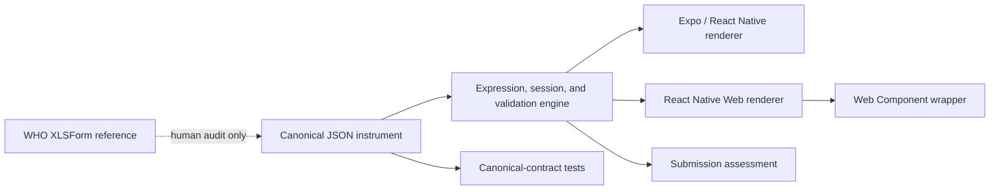

# Architecture

## Contract and provenance boundary

The checked-in JSON instrument is the authoritative executable contract. Runtime code, package builds, application bundles, and automated tests read that contract directly. The WHO XLSForm is retained only as provenance/reference evidence for human review; no code path parses it or generates runtime artifacts from it. The repository does not depend on an Excel library.

## Canonical contract

Each question carries its WHO identifier, source row and type, answer data type, UI control, localized text, coded choices, requiredness, group path, relevance, constraint, error message, calculation, and source metadata. Expressions are compiled into a platform-neutral AST so no ODK or browser expression interpreter is required at runtime.

The contract is intentionally checked in and maintained directly. Changes can therefore be reviewed as ordinary diffs, and builds remain deterministic and work without reading the workbook. On first use, `compileInstrumentDefinition()` validates names, hierarchy, controls/data types, choices, and expressions; builds immutable indexes; and freezes the accepted definition. Expression source is canonical: a supplied AST must match it, and runtime evaluation reuses the cached source-derived AST.

## Shared behavior

`createWhoVaSession()` owns current-section navigation and answer mutation. Instruments can be replaced only by a presentation-equivalent definition with the same identity and version, allowing translated labels without silently changing interview semantics. It calls the same public functions used by server-side submission checks:

- `applyCalculations()`
- `isQuestionRelevant()`
- `validateAnswer()`
- `validateSubmission()`

Invisible answers and fields not declared by the instrument are removed from normalized submission output. Session initialization and replacement also ignore unknown fields. Calculated values are recomputed from answers. Invalid types and values outside a WHO choice list are rejected before they enter session state.

Question cards report their content position to the shared renderer. Failed Next or Complete validation aligns the first issue at the top of the viewport, highlights its card, and, on web, focuses its first interactive control. This behavior applies equally to ordinary WHO constraints and incomplete date/year drafts.

Interactive controls live in a reusable registry exported as `WhoVaQuestionControls` by both platform entry points. The form owns question cards, session state, validation, draft persistence, and navigation; each control component owns only its input behavior. The registry includes text/multiline narrative, integer, date/year, choice, confirm, audio, image, PDF file, note, calculated, and system components.

## Platform services

The form package does not own device-specific storage, identity, audio recording, upload, encryption, or synchronization. Hosts inject those services or consume callbacks. This keeps the questionnaire portable across Expo SDK versions and deployment environments.

Full-date browser questions use the native, locale-aware HTML calendar control. Expo and React Native hosts can inject `platform.pickDate(question, data, currentValue)` and return an ISO `YYYY-MM-DD` value from their preferred native date-picker library. Without it, the validated text fallback uses localized month abbreviations and locale ordering (`DD-MMM-YYYY`, `MMM-DD-YYYY`, or `YYYY-MMM-DD`). Questions declared with the WHO `year` appearance use a shared four-digit year input and normalize the value to January 1 of that year, matching the date-valued source contract. Submission data remains ISO regardless of the displayed format.

Audio capture uses `platform.captureAudio(question, data)`. The returned typed audio attachment reference becomes the stored answer and can point to encrypted local storage, a content URI, or an upload record owned by the host.

Image and file controls use `platform.captureImage`, `platform.selectImage`, and `platform.selectFile`. These produce temporary attachment candidates; processors turn them into discriminated processed image or retained-PDF references before they enter answers. The PDF control supplies `application/pdf` as its accepted MIME type. Web adapters use browser file inputs; native hosts connect Expo or React Native camera, image-library, and document-picker packages. Rotation and zoom are presentation state and do not mutate the original attachment.

## Draft persistence

Drafts use a stable UUID and a versioned, platform-neutral envelope containing instrument identity/version, current section, timestamps, and the unvalidated submission data. The decoder migrates legacy unversioned drafts to schema version 1 and rejects malformed or unknown versions. Manual Save draft and every Next/Complete press write the same envelope when a host store is configured. Web, Expo, and React Native hosts inject a `WhoVaDraftStore` backed by protected app storage; no renderer persists by default. Browser history contains only draft/navigation metadata and cannot restore navigation from a different configured draft. The explicit `createInsecureWhoVaBrowserDefaults()` helper exists for demos and low-risk prototypes. Draft metadata remains outside the canonical WHO answer object.

## Test boundary

Runtime tests operate through expression, validation, session, and embedding APIs. The parameterized question suite covers every question in the canonical JSON and checks both field-level and isolated submission behavior. Tracer tests additionally exercise navigation, calculations, custom-element events, and the no-Excel code/build/runtime boundary. Workbook-to-contract provenance comparison is a manual audit documented separately.
