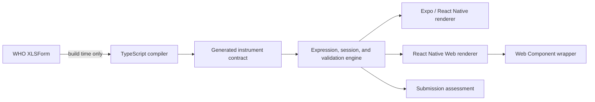

# Architecture

## Source and runtime boundary

The WHO XLSForm is immutable source evidence. `scripts/convert-xlsform.ts` reads it during development and produces a versioned JSON instrument. Neither Excel nor `exceljs` is imported from the public runtime.

## Canonical contract

Each question carries its WHO identifier, source row and type, answer data type, UI control, localized text, coded choices, requiredness, group path, relevance, constraint, error message, calculation, and source metadata. Expressions are compiled into a platform-neutral AST so no ODK or browser expression interpreter is required at runtime.

The generated artifact is intentionally checked in. Changes can therefore be reviewed as ordinary diffs and the runtime works in offline applications without the workbook.

## Shared behavior

`createWhoVaSession()` owns current-section navigation and answer mutation. It calls the same public functions used by server-side submission checks:

- `applyCalculations()`
- `isQuestionRelevant()`
- `validateAnswer()`
- `validateSubmission()`

Invisible answers are removed from normalized submission output. Calculated values are recomputed from answers. Invalid types and values outside a WHO choice list are rejected before they enter session state.

Question cards report their content position to the shared renderer. Failed Next or Complete validation aligns the first issue at the top of the viewport, highlights its card, and, on web, focuses its first interactive control. This behavior applies equally to ordinary WHO constraints and incomplete date/year drafts.

Interactive controls live in a reusable registry exported as `WhoVaQuestionControls` by both platform entry points. The form owns question cards, session state, validation, draft persistence, and navigation; each control component owns only its input behavior. The registry includes text/multiline narrative, integer, date/year, choice, confirm, audio, image, PDF file, note, calculated, and system components.

## Platform services

The form package does not own device-specific storage, identity, audio recording, upload, encryption, or synchronization. Hosts inject those services or consume callbacks. This keeps the questionnaire portable across Expo SDK versions and deployment environments.

Full-date browser questions use the native, locale-aware HTML calendar control. Expo and React Native hosts can inject `platform.pickDate(question, data, currentValue)` and return an ISO `YYYY-MM-DD` value from their preferred native date-picker library. Without it, the validated text fallback uses localized month abbreviations and locale ordering (`DD-MMM-YYYY`, `MMM-DD-YYYY`, or `YYYY-MMM-DD`). Questions declared with the WHO `year` appearance use a shared four-digit year input and normalize the value to January 1 of that year, matching the date-valued source contract. Submission data remains ISO regardless of the displayed format.

Audio capture uses `platform.captureAudio(question, data)`. The returned attachment reference becomes the stored answer and can point to encrypted local storage, a content URI, or an upload record owned by the host.

Image and file controls use `platform.captureImage`, `platform.selectImage`, and `platform.selectFile`. The PDF control supplies `application/pdf` as its accepted MIME type. Web adapters use browser file inputs; native hosts connect Expo or React Native camera, image-library, and document-picker packages. Rotation and zoom are presentation state and do not mutate the original attachment.

## Draft persistence

Drafts use a stable UUID and a platform-neutral envelope containing instrument identity/version, current section, timestamps, and the unvalidated submission data. Manual Save draft and every Next/Complete press write the same envelope. Web defaults to `localStorage`; Expo and React Native hosts inject a `WhoVaDraftStore` backed by their chosen durable app storage. Draft metadata remains outside the canonical WHO answer object.

## Test boundary

Tests operate through public compiler, expression, validation, session, and embedding APIs. The parameterized question suite covers all named WHO rows and checks both field-level and isolated submission behavior. Tracer tests additionally exercise navigation, calculations, custom-element events, and the no-Excel runtime boundary.
